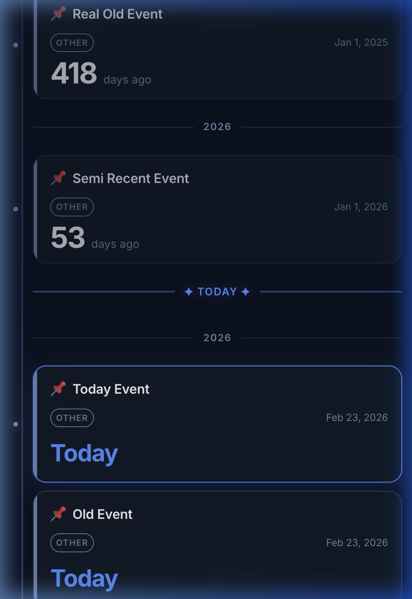
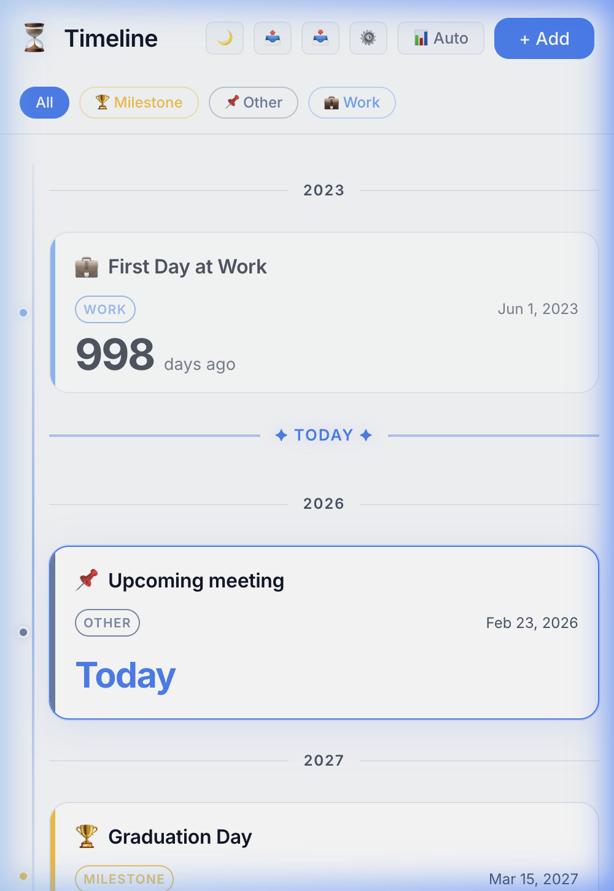
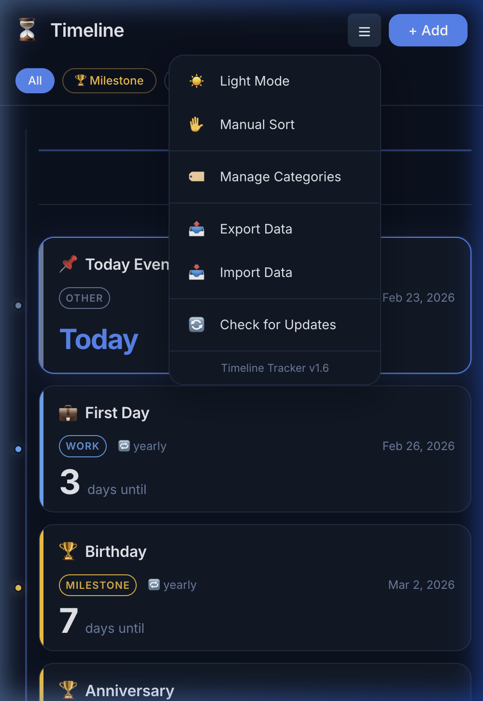

# ⏳ Timeline Tracker

A beautiful, offline-first Progressive Web App for tracking life's important moments. See how far you've come and what's ahead — all in one personal timeline.

<p align="center">
  
  
</p>

## ✨ Features

- **Time Anchors** — Every event is a date anchor. Countdowns and elapsed days are always computed live
- **Smart Timeline** — Events radiate from today: past events oldest-first, future events nearest-first
- **Recurring Events** — Birthdays, anniversaries, and yearly milestones with automatic next-occurrence calculation
- **Date Ranges** — Track trips, projects, and multi-day events with start and end dates
- **Categories & Filters** — Organize with categories (Birthday 🎂, Travel ✈️, Work 💼, Life 🧘, etc.)
- **Dark & Light Mode** — Gorgeous glassmorphism UI in both themes
- **Installable PWA** — Install on your phone's home screen, works fully offline
- **Auto-hide Header** — More screen space while scrolling, header reappears when you stop
- **Scroll to Today** — Floating button with animated arrows to jump back to today's marker
- **Data Backup** — Export/import your timeline as JSON
- **Auto Updates** — PWA automatically checks for updates with a clean update prompt

<p align="center">
  
</p>

## 🚀 Getting Started

### Requirements

- Node.js (LTS)
- npm

### Install & Run

```bash
npm install
npm run dev
```

Open [http://localhost:5173](http://localhost:5173) in your browser.

### Build for Production

```bash
npm run build
```

### Deploy to GitHub Pages

Push to `main` — the included GitHub Actions workflow automatically builds and deploys.

## 🏗️ Tech Stack

| Layer | Technology |
|-------|-----------|
| Framework | React 18 + TypeScript |
| Build | Vite |
| Storage | IndexedDB (via `idb`) |
| PWA | `vite-plugin-pwa` + Workbox |
| Styling | Vanilla CSS with custom properties |
| Hosting | GitHub Pages |

## 📐 Architecture

The app follows a simple, maintainable architecture:

```
src/
├── components/     # React UI components
│   ├── EventCard        # Individual event display
│   ├── EventForm        # Create/edit event modal
│   ├── TimelineView     # Main timeline with dividers
│   ├── SettingsMenu     # Hamburger menu dropdown
│   └── ...
├── hooks/          # Custom React hooks
│   ├── useEvents        # CRUD + sorting logic
│   ├── useTheme         # Dark/light mode
│   └── useServiceWorker # PWA update management
├── utils/          # Pure utility functions
│   ├── timeCalc         # Date math & recurrence
│   └── dataBackup       # Export/import logic
├── db/             # IndexedDB storage layer
└── types/          # TypeScript type definitions
```

### Key Principle

> We store **dates**, not counters. All countdowns and elapsed days are derived values computed dynamically.

## 🎨 Design Philosophy

- **Calm & minimal** — time-focused, not cluttered
- **Mobile-first** — responsive from 320px to 4K
- **Offline-first** — everything works without internet
- **Privacy-first** — all data stays on your device

## 📋 Roadmap

| Phase | Status |
|-------|--------|
| MVP (CRUD, persistence, PWA) | ✅ Complete |
| PWA Enhancement (updates, install) | ✅ Complete |
| Timeline Experience (categories, smart sort, scroll-to-today) | ✅ Complete |
| Notifications (push reminders) | 🔜 Planned |
| Analytics & Reflections | 💭 Future |

## 📄 License

MIT
